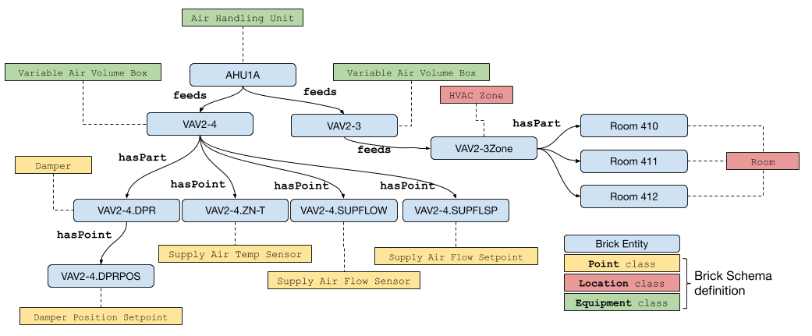

Core Concepts
==============

These are the essential concepts of Brick.

## Entity

An entity is an abstraction of any physical, logical or virtual item; the actual "things" in a building.

Physical entities are anything that has a physical presence in the world.
Examples are mechanical equipment such as air handling units, variable air volume boxes, luminaires and lighting systems, networked devices like electric meters, thermostats and electrical vehicle chargers, and spatial elements like rooms and floors.

Virtual entities are anything whose representation is based in software.
Examples are sensing and status points which allow software to read the current state of the world (such as the value of a temperature sensor, the speed of a fan, or the energy consumption of a space heater), and actuation points which allow software to write values (such as temperature setpoints or the brightness of a lighting fixture).

Logical entities are those entities or collections of entities that are defined by a set of rules.
Examples are HVAC zones and Lighting zones.
Concepts such as class names and tags (defined below) also fall into this category.
</details>

## Tag

A **tag** is an atomic fact or attribute of an entity.
Examples of tags are `sensor`, `setpoint`, `air`, `water`, `discharge`, `leaving` and `vav`.
Brick borrows the concept of tags from Project Haystack in order to preserve the flexibility and ease of use for annotation; however, Brick does not rely on tags alone to determine the type of an entity.

## Class

A **class** is a named category with intensional meaning (a definition) used for grouping entities.
Classes are organized into a hierarchy, and entities are instances of one or more classes (that is, the type of an entity is given by one or more classes).
Classes also have a set of associated tags, which provide helpful annotations for discovery.

## Relationship

A **relationship** defines the nature of a link between two related entities.
Examples of relationships are *encapsulation* (one entity is contained within another), *sequence* (one entity takes effect before another in some process) and *instantiation* (one entity's type is given by another entity).

For a more detailed look at relationships in Brick and how/when to use them, read the [Relationship documentation](/brick/relationships).

## Graph

A **graph** is an abstract organizational data structure representing a set of entities (nodes) and relationships (edges). Brick is represented by a directed, labeled graph.

```{image} ../img/node-edge-graph.png
:width: 400px
:align: center
```

This figure is an illustration of a generic directed graph. In the context of Brick, nodes in a graph are entities and the edges of the graph are relationships. The source and destination nodes of an edge indicate the subject and object entities of the relationship given by the name of the edge.

We recommend reading the [Wikipedia page on the abstract graph data structure](https://en.wikipedia.org/wiki/Graph_(abstract_data_type)).

In Brick, the graph is represented using the RDF data model. The [RDF primer page](https://www.w3.org/TR/rdf11-concepts/) is an excellent introduction to how a graph is represented using RDF.


## Brick Model 

A **Brick model** is a digital representation of a building that adheres to the Brick schema. Entities in a Brick model are classified according to the classes defined by Brick, and are connected using the relationships defined by Brick. Several reference models are [available for download](/resources/#reference-brick-models).




The blue nodes represent entities that are instances of Brick classes.These are the "things" inside our example building. They range from equipment (`AHU1A`, `VAV2-4`), points (`VAV2-4.DPRPOS`), locations (`Room 410`) and logical collections (`VAV2-3Zone`). The colored boxes connected to the instances with dashed lines represent Brick classes; the dashed line represents the "is an instance of" relationship (`rdf:type`). The rest of the class structure has been elided for simplicity. Lastly, the solid directed edges represent Brick relationships between entities.
